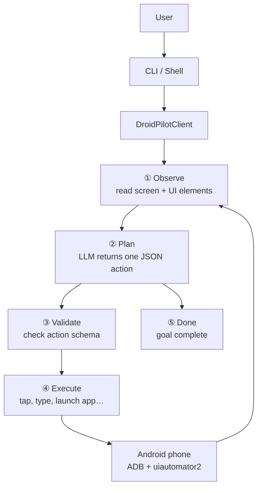

# DroidPilot

DroidPilot is a Python CLI for **AI-assisted Android automation**. You describe a goal in natural language — open Chrome and search, launch the calculator, change a setting, send a message — and DroidPilot observes the phone, asks an LLM for the next step, validates that step, and executes it on the device over **ADB** and **uiautomator2**.

The LLM never runs raw shell commands. It only returns a **typed JSON action** (tap, type, launch_app, etc.). DroidPilot validates that action and maps it to safe device operations.

---

## Table of contents

- [What DroidPilot does](#what-droidpilot-does)
- [Architecture](#architecture)
- [Project layout](#project-layout)
- [Installation](#installation)
- [ADB and device setup](#adb-and-device-setup)
- [Environment configuration](#environment-configuration)
- [LLM setup and action contract](#llm-setup-and-action-contract)
- [Running DroidPilot](#running-droidpilot)
- [Supported action types](#supported-action-types)
- [How each layer works](#how-each-layer-works)
- [Safety boundary](#safety-boundary)
- [Extending DroidPilot](#extending-droidpilot)
- [Troubleshooting](#troubleshooting)

---

## What DroidPilot does

| Capability | Example |
|---|---|
| Natural-language goals | `open Chrome and search for Saketh` |
| Direct device commands | `droidpilot tap "Chrome"`, `droidpilot type "hello"` |
| Multi-step automation | Opens app → taps field → types → presses Enter |
| Any Android app | Browser, Calculator, Settings, Messages, Camera, Play Store, … |
| Session replay | `droidpilot history`, `droidpilot code` exports Python script |

**Core loop (one step at a time):**

1. **Observe** — screenshot + UI hierarchy + current app package
2. **Plan** — LLM picks the next single action from the goal + state
3. **Validate** — Pydantic schema checks the action
4. **Execute** — uiautomator2 performs tap / type / swipe / launch
5. **Repeat** until the agent returns `done` or `max_steps` is reached

---

## Architecture

DroidPilot has **five layers**. The LLM only sits in the planning step — it never talks to the phone directly.



### What happens in one step

| Step | Layer | What it does |
|---|---|---|
| **① Observe** | `device/` | Screenshot, UI hierarchy, current app package |
| **② Plan** | `agent/` | Sends goal + UI to Gemini; gets back JSON like `{"type":"tap","element_id":5}` |
| **③ Validate** | `actions/` | Rejects bad or unknown actions before they run |
| **④ Execute** | `actions/` + `device/` | Maps action to uiautomator2 calls on the phone |
| **⑤ Done** | `agent/` | LLM returns `{"type":"done"}` when the goal is finished |

This loop runs until **done** or **max_steps** (default 20).

### Example: `open Chrome and search for Saketh`

```text
Step 1  Observe → home screen          Plan → launch_app(com.android.chrome)
Step 2  Observe → Chrome open          Plan → tap url bar
Step 3  Observe → cursor in url bar    Plan → type "Saketh"
Step 4  Observe → text entered           Plan → press enter
Step 5  Observe → search results       Plan → done
```

### Key design rules

- **LLM outputs JSON only** — no shell commands, no raw ADB strings
- **Validator is the gate** — only whitelisted actions (`tap`, `type`, `launch_app`, …) reach the device
- **Stable taps** — element bounds from the last observation are cached so UI re-indexing does not crash the run
- **Errors are soft** — a bad tap returns an error result and the loop tries again with fresh UI state

### Main modules

| Folder | Role |
|---|---|
| `cli.py` | Commands and interactive shell |
| `client.py` | Runs the observe → plan → validate → execute loop |
| `agent/` | LLM planner (Gemini, Groq, or mock fallback) |
| `actions/` | Action schemas, validation, execution |
| `device/` | Phone connection via uiautomator2 + ADB |
| `state/` | `DeviceState` and numbered `UIElement` list |
| `session/` | History log and Python code export |

---

## Project layout

```text
DroidPilot/
├── src/droidpilot/
│   ├── cli.py                 # CLI entry + interactive shell
│   ├── client.py              # DroidPilotClient orchestration
│   ├── config.py              # Environment settings
│   ├── actions/
│   │   ├── models.py          # Pydantic action schemas
│   │   ├── validator.py       # Schema validation
│   │   └── executor.py        # Action → device calls
│   ├── agent/
│   │   ├── base.py            # Agent ABC
│   │   ├── gemini_agent.py    # Google GenAI planner
│   │   ├── groq_agent.py      # Groq planner (optional)
│   │   ├── mock_agent.py      # Deterministic fallback (no API key)
│   │   ├── prompts.py         # System prompt + user payload builder
│   │   ├── json_utils.py      # Robust JSON extraction
│   │   └── action_builder.py  # LLM dict → ActionModel
│   ├── device/
│   │   ├── base.py            # AndroidDevice ABC
│   │   ├── uiautomator.py     # uiautomator2 implementation
│   │   └── adb.py             # Low-level ADB helpers
│   ├── state/
│   │   └── models.py          # DeviceState, UIElement
│   └── session/
│       ├── history.py         # Step recording
│       └── codegen.py         # Export session as Python
├── tests/
├── pyproject.toml
├── main.py
└── README.md
```

---

## Installation

1. **Clone the repository**

```bash
git clone <repo-url>
cd DroidPilot
```

2. **Create and activate a virtual environment**

```bash
python -m venv .venv
# Windows
.venv\Scripts\activate
# macOS / Linux
source .venv/bin/activate
```

3. **Install the package**

```bash
pip install -e ".[dev]"
```

4. **Verify the CLI**

```bash
droidpilot --help
```

---

## ADB and device setup

ADB is required for PC ↔ phone communication.

### Install ADB

| OS | Command |
|---|---|
| **Windows** | Install [Android SDK Platform Tools](https://developer.android.com/tools/releases/platform-tools), add `platform-tools` to `PATH` |
| **macOS** | `brew install android-platform-tools` |
| **Linux** | `sudo apt install android-tools-adb` |

Verify:

```bash
adb version
adb devices
```

### Enable USB debugging on the phone

1. Settings → About phone → tap **Build number** 7 times
2. Settings → Developer options → enable **USB debugging**
3. Connect via USB and approve the debug prompt
4. Confirm with `adb devices` (status should be `device`)

### uiautomator2

On first connect, uiautomator2 may install its agent APK on the device automatically. Ensure the phone stays unlocked during initial setup.

---

## Environment configuration

Create a `.env` file in the project root:

```env
# Required for LLM-powered goals (Gemini)
GOOGLE_API_KEY=your_google_api_key_here
GEMINI_MODEL=gemini-2.0-flash

# Provider selection
DROIDPILOT_PROVIDER=gemini

# Optional
DROIDPILOT_MAX_STEPS=20
DROIDPILOT_SCREENSHOT_DIR=./screenshots
DROIDPILOT_DEVICE_ID=          # leave empty for default device

# Optional Groq support
GROQ_API_KEY=
GROQ_MODEL=llama-3.3-70b-versatile
```

Settings are loaded via `pydantic-settings` in `config.py`.

| Variable | Default | Purpose |
|---|---|---|
| `GOOGLE_API_KEY` | — | Enables Gemini planner |
| `GEMINI_MODEL` | `gemini-3.5-flash` | Model name for `google.genai` |
| `DROIDPILOT_PROVIDER` | `gemini` | Which planner to use |
| `DROIDPILOT_MAX_STEPS` | `20` | Max steps per `run_goal` |
| `DROIDPILOT_DEVICE_ID` | auto | ADB serial for multi-device setups |

If `GOOGLE_API_KEY` is missing, DroidPilot uses **MockAgent** — a small deterministic planner for Chrome / Calculator / Settings demos without calling an API.

---

## LLM setup and action contract

DroidPilot uses the **Google GenAI SDK** (`google.genai`), not the deprecated `google.generativeai`.

The model must return **one JSON object per step**. Examples:

**Tap by element id (from `inspect` / `ui_elements`):**

```json
{"type": "tap", "element_id": 42}
```

**Tap by visible text:**

```json
{"type": "tap", "target": {"text": "Chrome"}}
```

**Launch an app by package name:**

```json
{"type": "launch_app", "package": "com.android.chrome"}
```

**Type into focused field:**

```json
{"type": "type", "text": "Saketh"}
```

**Mark goal complete:**

```json
{"type": "done", "reason": "Search results displayed"}
```

**Wait for UI transition:**

```json
{"type": "wait", "seconds": 1.5}
```

Compatibility: the builder also accepts `"action"` instead of `"type"`, and `"completed"` / `"finish"` as aliases for `"done"`.

Parsing is resilient — markdown code fences and surrounding prose are stripped before `json.loads`.

---

## Running DroidPilot

### Device discovery and connection

```bash
droidpilot devices
droidpilot connect
droidpilot config          # show current settings
```

### Manual device control (no LLM)

```bash
droidpilot screenshot
droidpilot inspect         # numbered UI elements with bounds
droidpilot open com.android.chrome
droidpilot tap "Chrome"
droidpilot tap --element 12
droidpilot type "hello"
droidpilot press enter
droidpilot press home
droidpilot swipe up
droidpilot scroll down
```

### AI goal execution

```bash
droidpilot run "open Chrome and search for Saketh"
droidpilot run "open calculator" --max-steps 30
droidpilot run "open Settings and enable dark mode"
```

### Interactive shell

```bash
droidpilot shell
```

Example session:

```text
DroidPilot > devices
DroidPilot > inspect
DroidPilot > tap "Chrome"
DroidPilot > type "Saketh"
DroidPilot > press enter
DroidPilot > open Chrome and search for Saketh
DroidPilot > open calculator
DroidPilot > run "open Settings"
DroidPilot > history
DroidPilot > code
DroidPilot > exit
```

The shell treats free-form text as a natural-language goal. Errors are printed in red but **do not crash the shell** — the loop retries or continues.

### Session export

```bash
droidpilot history         # print step log
droidpilot code            # generate replayable Python script
droidpilot export out.json # export raw session JSON
```

---

## Supported action types

| Action | JSON example | Device operation |
|---|---|---|
| `launch_app` | `{"type":"launch_app","package":"com.android.settings"}` | `device.app_start(package)` |
| `tap` | `{"type":"tap","element_id":5}` | Click center of element bounds |
| `tap` | `{"type":"tap","target":{"text":"OK"}}` | uiautomator2 selector click |
| `type` | `{"type":"type","text":"hello"}` | `device.send_keys(text)` |
| `press` | `{"type":"press","key":"enter"}` | `device.press(key)` |
| `swipe` | `{"type":"swipe","direction":"up"}` | Full-screen swipe gesture |
| `scroll` | `{"type":"scroll","direction":"down"}` | Scroll gesture |
| `home` | `{"type":"home"}` | Home button |
| `back` | `{"type":"back"}` | Back button |
| `wait` | `{"type":"wait","seconds":2}` | Sleep (UI loading) |
| `done` | `{"type":"done","reason":"…"}` | Stop loop — goal complete |
| `screenshot` | `{"type":"screenshot"}` | Capture screen |

### Common Android package names

| App | Package |
|---|---|
| Chrome | `com.android.chrome` |
| Calculator (Google) | `com.google.android.calculator` |
| Calculator (AOSP) | `com.android.calculator2` |
| Settings | `com.android.settings` |
| Messages | `com.google.android.apps.messaging` |
| Play Store | `com.android.vending` |
| Camera | `com.android.camera2` |

Package names vary by OEM. Use `adb shell pm list packages | grep calc` to discover yours.

---

## How each layer works

### 1. CLI (`cli.py`)

- Built with **Typer** + **Rich**
- `normalize_shell_command()` strips surrounding quotes from shell input
- Routes `run …`, `open …`, or free text to `run_goal()`
- Wraps the shell loop in `try/except` so one failed step does not exit the REPL

### 2. Client (`client.py`)

`DroidPilotClient` is the main API:

```python
from droidpilot.client import DroidPilotClient

client = DroidPilotClient()
client.connect()
results = client.run_goal("open calculator")
```

`run_goal()`:

1. Calls `device.observe()` each iteration
2. Builds `DeviceState` with numbered `UIElement` list
3. Passes `goal`, `state`, and recent `history` to the agent
4. Validates and sanitizes actions (element_id range check)
5. Executes via `ActionExecutor`
6. Stops on `status: completed` or after 3 consecutive errors

### 3. Agent (`agent/`)

**GeminiAgent** sends:

- `SYSTEM_PROMPT` — allowed actions, rules, common packages
- User payload — goal, `current_package`, ranked `ui_elements`, recent actions

It requests JSON mode when supported, retries on empty/malformed responses, and uses `extract_json_object()` + `build_action_from_llm()`.

**MockAgent** provides offline demos for Chrome search, Calculator, and Settings without an API key.

### 4. Validator (`actions/validator.py`)

Maps `{"type": "tap", ...}` dicts to typed Pydantic models (`TapAction`, etc.). Rejects unknown types and invalid fields **before** any device call.

### 5. Executor (`actions/executor.py`)

Dispatches each action to `AndroidDevice` methods. Tap failures return `{"status": "error", ...}` instead of raising, so the goal loop can recover.

### 6. Device (`device/uiautomator.py`)

- Connects via **uiautomator2** (wraps ADB)
- `parse_hierarchy_xml()` flattens Android accessibility XML into tap targets
- `tap_element()` prefers cached bounds from the last `inspect()` / `observe()`
- `observe()` returns screenshot path, UI elements, current package, device info

---

## Safety boundary

The LLM **cannot** run arbitrary commands on the phone. Every action passes through validation first:

```text
LLM JSON  →  Validator (whitelist)  →  Executor (fixed methods)  →  uiautomator2
```

- Only whitelisted `type` values pass (`tap`, `type`, `launch_app`, …)
- Each type maps to one device method with fixed parameters
- Invalid taps fail softly — the agent gets fresh UI state on the next step

---

## Extending DroidPilot

### Add a new action type

1. Add a Pydantic model in `actions/models.py` and register it in `ACTION_MODELS`
2. Handle it in `actions/executor.py`
3. Implement the device method in `device/uiautomator.py` + `device/base.py`
4. Document the JSON shape in `agent/prompts.py` (`SYSTEM_PROMPT`)
5. Parse it in `agent/action_builder.py`
6. Add tests under `tests/`

### Add a new LLM provider

1. Subclass `Agent` in `agent/base.py`
2. Implement `next_action(goal, state, history)` returning an `ActionModel`
3. Reuse `prompts.py`, `json_utils.py`, and `action_builder.py`
4. Wire it in `client.py` based on `settings.provider`

### Use programmatically (no CLI)

```python
from droidpilot.client import DroidPilotClient

client = DroidPilotClient()
client.connect()

# Single action
client.tap(text="Chrome")
client.type_text("Saketh")
client.press("enter")

# Full goal
results = client.run_goal("open calculator and compute 2+2")
for step in results:
    print(step)
```

---

## Troubleshooting

### Device not detected

```bash
adb devices
adb kill-server && adb start-server
```

Check: USB debugging on, cable supports data, RSA fingerprint approved, correct drivers (Windows).

### `Element N does not exist`

- Run `droidpilot inspect` to see current numbered elements
- UI may have changed between observation and tap — DroidPilot caches bounds to reduce this
- Prefer taps by `text` / `resource_id` when IDs are unstable

### LLM returns invalid JSON

- Confirm `GOOGLE_API_KEY` is set: `droidpilot config`
- DroidPilot retries up to 4 times and strips markdown fences
- Try a stable model via `GEMINI_MODEL=gemini-2.0-flash`

### Goal stops early with errors

- Three consecutive step errors abort the loop (see `client.run_goal`)
- Check `droidpilot history` for the failing action/result
- Increase steps: `droidpilot run "…" --max-steps 40`

### App won't launch

- Verify package name: `adb shell pm list packages | grep -i calc`
- Some OEM apps use different package IDs than listed above

### uiautomator2 connection issues

- Keep the phone unlocked
- Re-run `python -m uiautomator2 init` if the agent APK is missing
- Specify device: `DROIDPILOT_DEVICE_ID=<serial>`

---

## Running tests

```bash
python -m pytest tests/ -q
```

Tests cover action validation, hierarchy XML parsing, shell parsing, mock agent heuristics, and JSON extraction from LLM output.

---
